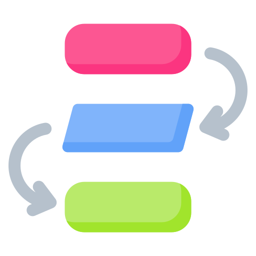
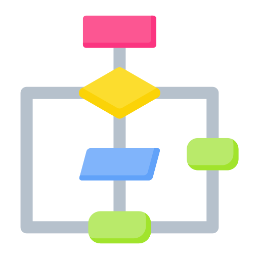

# Booleans and Conditional Statements

---

Erin R. Hoffman, February 2022

## Prerequisites

Before this lesson, students should already be able to:

* Create ***variables*** in Java, such as strings and integers
* Use ***expressions*** to manipulate and combine variables
* Follow the appropriate ***order of operations*** in Java expressions, including math operations

---

## Learning Objectives

By the end of this lesson, students will be able to:

* Define the term ***control flow*** and explain why it is a useful tool in programming
* Describe the two values of the ***boolean*** data type in Java
* Apply ***operators*** to variables in order to form ***boolean expressions***
* Utilize boolean expressions in ***conditional statements*** that determine whether or not a given ***code block*** will be executed
* Practice translating English-language word problems into conditional statements and code blocks


---

## The Motivation: Control Flow

When do we need control flow?



<a href="https://www.flaticon.com/free-icons/workflow" title="workflow icons">Workflow icons created by Uniconlabs - Flaticon</a>

A better question might be...when do we **not** need control flow?

---

## The Boolean Data Type

### Recall: What Is a Data Type?

Some data types you have seen already include:

#### Strings


```Java

```

#### Integers


```Java

```

#### Doubles


```Java

```

#### Boolean is another data type


```Java

```

#### Primitive or Object?

Recall that primitive data types:

* Start with a lowercase letter
* Cannot be dereferenced (i.e. `.getClass()` method will not work)


```Java

```

---

<details>
    <summary style="cursor: pointer;">Clarification (click to expand)</summary>
    <p>Confusingly, there is also a wrapper object called <code>Boolean</code> (note the capital "B"). We won't be using it, but you can read the documentation <a href="https://docs.oracle.com/en/java/javase/11/docs/api/java.base/java/lang/Boolean.html">here</a> if you're curious</p>
</details>


### Boolean Data Type Recap

* There is another data type called `boolean`
* It is a primitive data type
* It can only have two values: `true` or `false`

---

Ok but...why?

## Boolean Operators and Expressions

### Equality


```Java

```

### Greater Than, Less Than


```Java

```

### Greater Than Or Equal To, Less Than Or Equal To


```Java

```

### And, Or, and Not

#### And


```Java

```

#### Or


```Java

```

#### Not


```Java

```

---

### Boolean Operators and Expressions Recap

* ***Boolean expressions*** are expressions that result in a boolean, although they can (and typically do) compare non-boolean values
* ***Boolean operators*** are used to make comparisons in boolean expressions. The Java boolean operators are:
  * `==` (is equal to)
  * `>` (is greater than)
  * `<` (is less than)
  * `>=` (is greater than or equal to)
  * `<=` (is less than or equal to)
  * `&&` (and)
  * `||` (or)
  * `!` (not)
  
---

## Conditional Statements

Now we can finally start to implement control flow!



<a href="https://www.flaticon.com/free-icons/process" title="process icons">Process icons created by Uniconlabs - Flaticon</a>

---

### `if`


```Java

```

### `else if`


```Java

```

### `else`


```Java

```

### Code Blocks: The Dreaded Curly Braces


```Java

```

### Conditional Statements Recap

* A ***conditional statement*** = a boolean expression + `if`, `else if`, or `else` keyword
* Conditional statements determine whether a given piece of code will be executed
* Typically this code is contained in a ***code block*** surrounded by curly braces

## Practice


```Java

```

## Recap

### Reviewing Learning Objectives

Now you should be able to:

* Define the term ***control flow*** and explain why it is a useful tool in programming


* Describe the two values of the ***boolean*** data type in Java


* Apply ***operators*** to variables in order to form ***boolean expressions***


```Java

```

* Utilize boolean expressions in ***conditional statements*** that determine whether or not a given ***code block*** will be executed


```Java

```

* Practice translating English-language word problems into conditional statements and code blocks

That's all, folks! Up next, another type of control flow: loops.
